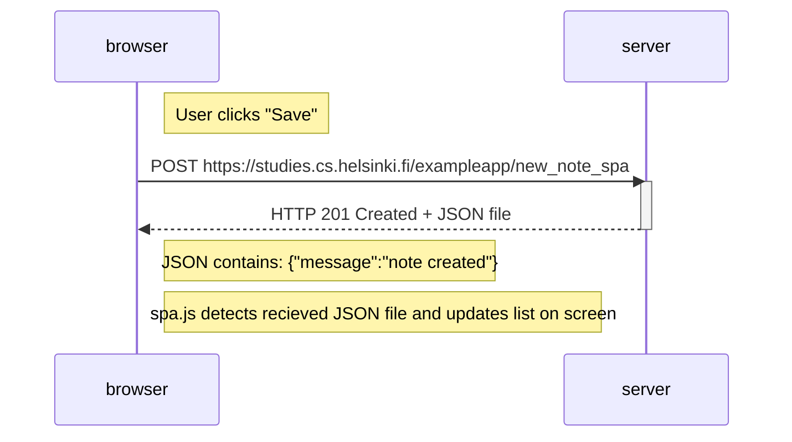

```mermaid
sequenceDiagram
    participant browser
    participant server

    Note right of browser: User clicks "Save" 

    browser ->>server: POST https://studies.cs.helsinki.fi/exampleapp/new_note_spa
    activate server
    server-->>browser: HTTP 201 Created + JSON file
    deactivate server

    Note right of browser: JSON contains: {"message":"note created"}
    Note right of browser: spa.js detects recieved JSON file and updates list on screen

```